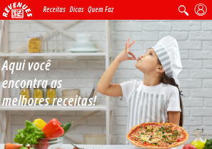
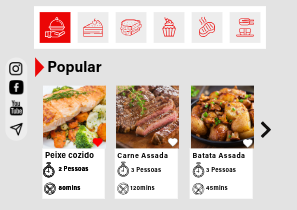
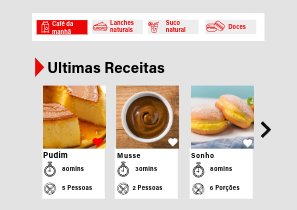
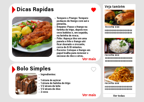
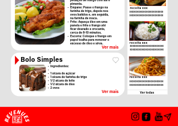
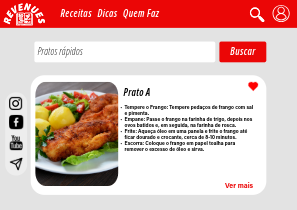
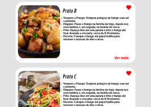
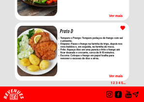
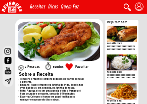
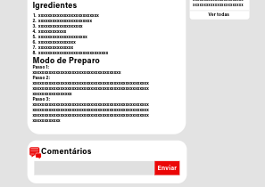

# Revenues
## Tela Inicial
**A ideia inicial do projeto se resume em criar um site de receitas de fácil acesso e fácil entendimento de como cozinhar.**

**O site irá fornecer menus superiores com cada sessão de receitas, por exemplo bolos, sopas, salgados, etc.**

**O feed inicial irá contar com as receitas mais bem avaliadas do site, assim se você for uma pessoa indecisa igual aquela sua ex namorada do colégio que te largou por um tal Everson que tinha uma cg 162cc vermelha com escapamento quebrado e era mais legal que você, você vai ter uma ideia do que quer ter na janta.**

###
## Segunda Tela
**Aqui você poderá ver como será a apresentação das receitas após pesquisar o que deseja nesse 
exemplo mostraremos oque a paginá irá exibir por uma pesquisa de "Pratos Rápidos"
podendo favoritar/salvar as receitas para serem vistas depois.**

## Terceira Tela

**Essa paginá irá exibir como a receita será apresentada após ser selecionada
com opções de comentar, favoritar alé de mostrar quantos pratos e o tempo de preparo
da receita!**

